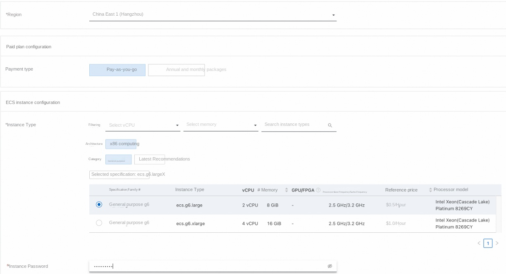
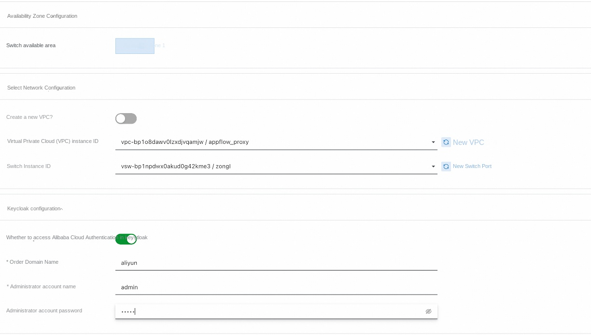
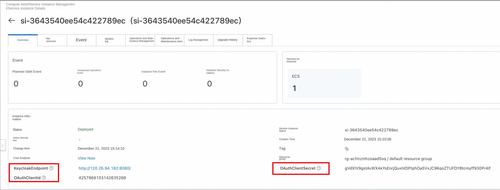
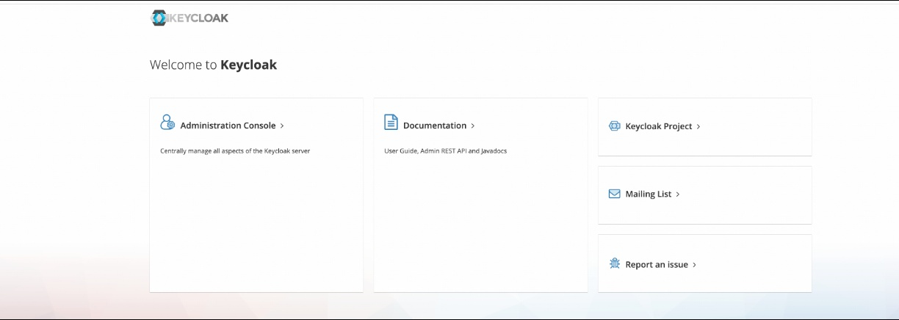
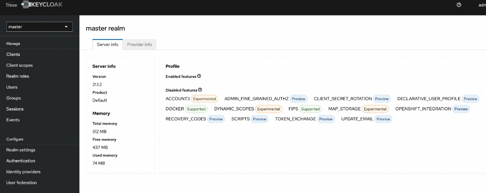

## Introduction
Keycloak is an open source identity and access management solution for modern applications and services. It provides a full set of security authentication and management features to help developers easily implement security authentication and single sign-on (SSO).

User Federation: Keycloak supports integration with existing user stores, such as LDAP or Active Directory, allowing users to log in using their existing credentials.
2. Identity Broker and Social Login (Identity Brokering and Social Login): Provides integration with external identity providers (such as Facebook, Google, Twitter, etc.). Users can log in using social accounts while supporting standard protocols such as OpenID Connect, SAML 2.0, and OAuth 2.0.
Fine-grained access control (Fine-grained Authorization): Keycloak allows the creation of detailed access control policies that define specific roles and permissions for each user or group to ensure that only the right users have access to sensitive resources.

## Prerequisites
To use a Keycloak service instance, you need to access and create some Alibaba Cloud resources. Therefore, your account must contain permissions for the following resources.
**Note**: This permission is required only when your account is a RAM account.

| Permission policy name | Comment |
| --- | --- |
| AliyunECSFullAccess | Permissions to manage ECS instances |
| AliyunVPCFullAccess | Permissions to manage a VPC |
| AliyunROSFullAccess | Manage permissions for Resource Orchestration Service (ROS) |
| AliyunComputeNestSupplierFullAccess | Manage merchant-side permissions for the compute nest service (ComputeNest) |

### Billing Description

The costs involved in Keycloak deployment are primarily related:

-Cloud Server Service (ECS) fee
-Traffic bandwidth charges
### Parameter Description

| Parameter group | Parameter item | Description |
| ------------ | ---------------- | ------------------------------------------------------------ |
| Service Instance | Service Instance Name | The service instance name must be no more than 64 characters in length and must start with an English letter. It can contain numbers, English letters, dashes (-), and underscores (_). |
| | Region | The region where the service instance is deployed | | |
| Payment Type Configuration | Payment Type | Pay-As-You-Go/Subscription |
| ECS instance configuration | Instance type | Deployed ECS instance type |
| | Instance Password | Server login password, 8-30 in length, must contain three items (uppercase letters, lowercase letters, numbers, ()'~!@#$%^& *_-+ =|{}[]:;' <>,.?/Special symbols) |
| Zone Configuration | Zone of the VSwitch | The zones in which the instance type can be deployed |
| Network configuration | Whether to create a VPC | Select whether to create a VPC in the current zone |
| | VPC instance ID | Select a VPC instance in the current zone |
| | VSwitch Instance ID | Select the VSwitch supported by the current VPC |
| Keycloak configuration | Whether to access Alibaba Cloud authentication in Keycloak | If Yes is selected, a Identity provider to enable Alibaba Cloud authentication will be created in the Keycloak |
| | RealmName | Alibaba Cloud authentication Identity provider and login client domain |
| | KeycloakAdminUserName | Administrator account name |
| | KeycloakAdminPassword | Administrator password |

## Deployment process
1. Select the payment type
2. Select the deployment region
3. Select the ECS instance type to be deployed and enter the instance password

4. Select the zone of the VSwitch, which is determined by the ECS instance type you select.
5. Select/New VPC and Switch (VSW)
6. Select whether to access Alibaba Cloud authentication. If selected, a Identity provider and a Client are built in the RealmName you entered. At the same time, an authentication client is built at Alibaba Cloud [OAuth](https://ram.console.aliyun.com/).
7. Enter the keycloak management account and password

## Use
### Access the console
1. Enter the console interface of the deployed compute nest instance.

2. If you choose to access Alibaba Cloud authentication before, the console will output additional OAuthClientId and OAuthClientSecret. This is not only the ID and Secret of the login app in the Keycloak, but also the ID and Secret of Alibaba Cloud OAuth authentication.
3. The KeycloakEndpoint output by the console is the access address of the Keycloak service.

4. Click "Administration Console" and enter the account name and password you set to enter the Keycloak management interface.

### Realm Configuration

Security isolation: Each realm is equivalent to a separate namespace that can contain its own users, roles, clients (applications), and other identity management-related configurations. This allows for an isolated secure environment for different organizations or projects on the same Keycloak server.

User management: Within a specific realm, administrators can create and manage user accounts, assign roles and permissions, and perform user authentication and authorization management.

Client application management: Each realm can configure and manage its own client applications, which can be web applications, single-page applications (SPAs), mobile applications, or backend services.

Identity providers: realm supports integration with various external identity providers (e. g., Facebook, Google, Microsoft, etc.) as well as enterprise identity management systems (e. g., LDAP, Active Directory).

Authentication process: realm allows you to customize the authentication process so that you can tailor the login process to your specific needs, including the configuration of multi-factor authentication (MFA) or single sign-on (SSO).

Protocol support: The Keycloak supports a variety of standard authentication protocols, such as OpenID Connect, OAuth 2.0, and SAML 2.0. The configuration in the realm determines the specific implementation and behavior of these protocols.

Events and auditing: Keycloak realm features event logging and auditing to track and record user activities, such as login attempts and password updates, for easy monitoring and compliance checking.

Themes and internationalization: realm can customize the look and feel of the user interface, support different themes, and provide internationalization options.

Token configuration: You can configure different types of tokens (such as access tokens, refresh tokens, and ID tokens) in realm, including their validity periods and signature algorithms.

Security policy: Administrators can define password policies, session policies, token policies, etc. within the realm to enhance the security of the system.

The Keycloak is created with a default realm, usually called "master", that manages the entire Keycloak instance. Administrators can create new realms in the master realm and configure the appropriate security policies and user access rules for these realms. In this way, the Keycloak can flexibly adapt to complex security requirements.

### Themes and Style
Keycloak supports custom interface themes, including the login page, administrator console, account management interface, and email templates.

1. **Change theme:**
-In the realm settings, select the "Themes" tab.
-For each different interface, you can select a theme from the drop-down menu.
-Save changes.
2. **Create a custom theme:**
-Custom themes need to be created in the theme directory of the Keycloak server.
-Create a new folder with the theme name of your choice.
-Create subfolders and files in this folder that define the HTML, styling CSS, and scripts for the page.
-Restart the Keycloak server to load the new theme.
-Select the new theme as the active theme in the admin console.
### User Management
User management is done in the realm and involves adding, editing, deleting users, and managing user properties, credentials, roles, and groups.

1. **Add new user:**
-In the realm configuration, select the Users menu item.
-Click the "Add user" button.
-Fill in the necessary user information, such as user name, email, first name, last name, etc.
-Click Save to create the user.
2. **Edit User Properties:**
-In the Users list, click the username of a specific user.
-You can edit a user's basic properties, role mappings, group memberships, user credentials, and even manage a user's session.
3. **User roles and fine-grained management:**
-Roles in the Keycloak can be assigned to users, groups of users, or entire realms.
-In the user editing interface, select the Role Mappings tab to assign the user a role at the realm or client level.
-You can also manage organizational units and simplify the assignment of roles to users.

User management is very flexible, allowing administrators to automate user operations through the built-in management console or using the REST API.
